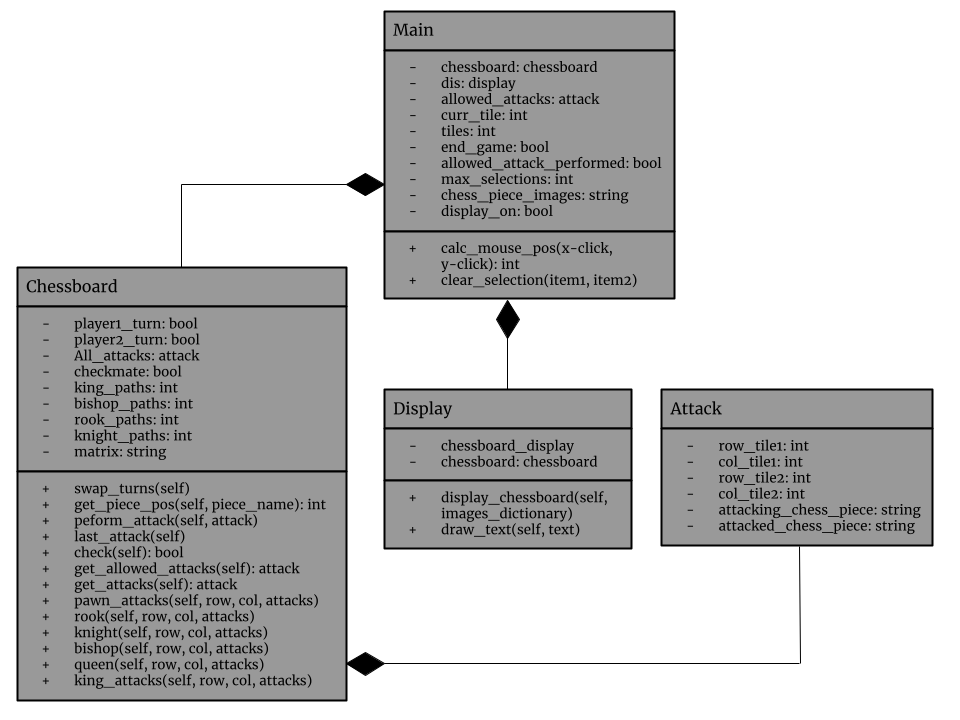

# Introduction
For our Final Project in 2140, we developed an interactive two player chess game developed using pygame. The first main feature of the game is  regarding specific attacks that are implemented for each chess piece on the chessboard. In addition, the program will automatically detect checks and checkmates and will prohibit the player from performing an attack that would result in a check for their king. The game includes pawn promotion where the pawn is automatically promoted to a queen if it reaches the end of the board. Furthermore, our game contains an end screen that displays checkmate to the user when a player wins the game. All in all, our implementation of chess was developed using three main classes: display, attack, and chessboard. 

## Class Diagram

## Application Design 
As mentioned in the introduction, our implementation of chess was developed with three main classes: display, attack, and chessboard. To begin with, the display class was primarily responsible for anything that was displayed to the screen. The display class contained two functions: display_Chessboard(self, images_dictionary) and draw_text(self, text). The display_Chessboard function begins with an algorithm that detects which squares should be tan or tan4(brown) to create the checkerboard pattern. As the number of tiles increases along the matrix, the algorithm executes and creates 45 x 45 pixel squares that alternate in color.  The second half of the display_Chessboard function draws in chess piece png images for each tile according to the board_display matrix values. The second function that was contained in the display class was drawText. This function began by filling the display with a white background (255,255,255). Afterwards, we set the font of the text and displayed it with the pygame’s .blit feature which displayed the text at the center of the GUI. 

The next class that was developed was the attack class which is responsible for performing an attack on the chessboard. This class allowed us to represent each attack as an object to store important information about each attack. In this class, the two tiles are stored and broken down into their location on the chessboard in terms of row and column, which are needed to perform each attack. The chess pieces on those two respective tiles are also stored.

The heart of the program occurs in the chessboard class which contains all the functions needed to initialize the matrix, move the pieces, and determine whether the king is in check. This class takes objects of the attack class to perform and validate attacks on the chessboard. The chessboard contains a master list of possible attacks each player could make which contains attack objects. 

All in all, the python file that pulls all these classes together is the main.py file which essentially runs the Chess program. The first portion of the main.py program focuses on initialization. The program begins by initializing pygame’s attributes and displaying the 360 x 360 pixel gui screen. The program also initializes all possible moves at the beginning of the game and all variables that keep track of whether the game is completed. The next step in the main function is with loading in the chess pieces as png images. During this process the program has a  dictionary loaded in with chess piece images and assigned to a specific chess piece name. This helps with naming where the specific pieces go on the chessboard matrix. In main.py it had two functions: calc_mouse_pos and clear_selection. Calc_mouse_pos calculates the position of a mouse click relative to the GUI display and returns the approximate position of a mouse click stored in a tuple. The position of the mouse click is relative to the top left corner of the display. The second function clear_selection simply clears the values stored in the tuple (item 1) and list (item 2). With all the functions and variables initialized, the main portion of the main.py file occurs in the loop which continues until the game is over. The first portion of the loop featured an if statement that tests if the user clicked on the same tile twice, otherwise, the program gets the row and col of the tile selected and appends it to a list. Additionally, if the user clicked twice, conduct the move if the move is allowed and clear the selection. Lastly update the variable that detects if an allowed move was made. The program also features an if statement that gets all possible moves that are allowed and resets the variable which checks whether an allowed move was made. Finally, The program ends the pygame application if the user clicks the x on the gui. Additionally, the program ends when the end_game variable is True which only occurs when a checkmate occurs. The main.py file imports pygame as p, chessboard.py, attack.py, and display.py. The chessboard.py file imports attack.py. The display.py file imports pygame as p.  

## Libraries and Tools 
The only library that was used in this program is Pygame which is a general set of modules and packages that assist users with developing games in Python. During the development of our program we primarily used Pygame to display the chessboard, detect user clicks, and display “Checkmate!” text to the screen after checkmate. Below are some important tools and resources that were utilized:  
Pygame documentation: https://www.pygame.org/docs/  
Chess PNG images we utilized in our program: https://opengameart.org/content/pixel-chess-pieces  

## Leasons Learned
During the development of this project, we learned an immense amount of knowledge with Object-Oriented Programming as we needed to utilize several classes to organize the code. In addition, we learned pygame and were successfully able to use the pygame functions to run Chess. Along with these two important skills, we also learned how to use Git and commit directly from PyCharm. 

If we had more time to spend on the project, we would have liked to integrate castling and en passant as they are well-known chess moves used by experienced Chess players. Furthermore, we would have liked to create a button that resets the chess board after the game is played. Rather than re-running the program on the IDE, this can make it easier for users to play multiple games in one sitting. 
